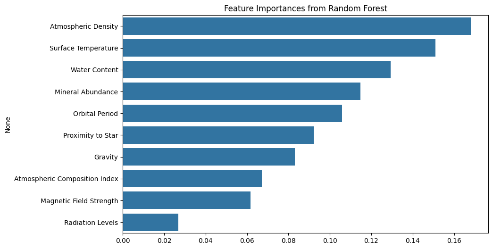

# Planetary  Classifier 🪐

This is my first machine learning project! It's a program that tries to predict whether a planet could be habitable based on data like its temperature, gravity, and water content.

---
## 📂 Project Structure

A clean and organized layout is essential for any project. Here’s how this one is structured:

> ```
> .
> ├──  planetary_dataset.csv         # The raw data used to train the model.
> ├── planetary_classifier.py  # The main Python script.
> ├── requirements.txt              # A list of necessary Python libraries.
> ├── feature_importance.png        # The saved chart of important features.
> └── README.md                     # This documentation file.
> ```

---


## 🛠️ Technical Stack

This section outlines the key technologies and libraries used to build the project.

* **Python:** The core programming language used for the project.
* **Pandas:** Used for loading, cleaning, and manipulating the planetary dataset.
* **Scikit-learn:** The most important library in this project. It provided all the tools for building, training, and testing the machine learning models.
* **Matplotlib & Seaborn:** Used together to create the final chart that visualizes which features the model found most important.
* **Joblib:** A simple tool used to save the final, trained model to a file.

---

## ⚙️ The Technical Pipeline

This is a step-by-step breakdown of how the Python script takes raw data and turns it into a smart, predictive model.


1.  **Load the Data:** The code starts by loading the dataset of planets (`planetary_dataset.csv`).

2.  **Clean the Data:** Real-world data is often messy. The script fills in any missing values. For numbers, it uses the average value, and for categories, it uses the most common one.

3.  **Prepare Data for the Model:** Machine learning models only understand numbers. So, the code converts any text-based columns into numerical ones.

4.  **Split the Data:** The data is split into a "training set" (to teach the model) and a "testing set" (to see how well it learned).

5.  **Train and Compare Models:** I trained three different types of models to see which was best for this task:
    * Logistic Regression
    * Naive Bayes
    * **Random Forest** (This one turned out to be the best!)

6.  **Hyperparameter Tuning:** This is like fine-tuning a car engine to get the best performance. The script uses a tool called `GridSearchCV` to automatically test different settings for the Random Forest model and find the combination that makes it the most accurate.

7.  **Check What's Important:** The code generates a chart showing which factors (like 'Surface Temperature' or 'Gravity') were the most important for making a prediction.

8.  **Save the Final Model:** The final, smartest version of the model is saved to a file called `best_random_forest_model.pkl`. This file can be used later to make new predictions without having to retrain everything.

---

## 🚀 How to Run It


1.  **Install the necessary libraries:**
    ```bash
    pip install -r requirements.txt
    ```

2.  **Run the script:**
    ```bash
    python planetary_classifier.py
    ```
    The script will print out its findings and save the model file.

---

## 📊 Results

The Random Forest model performed the best after being fine-tuned.

* **Best Model:** Random Forest Classifier
* **Best Settings Found:** `{'max_depth': None, 'min_samples_split': 2, 'n_estimators': 200}`
* **Overall Model Accuracy:**  `86.8%`
* **Weighted F1-Score:** `0.8677579801030829`

* For a more detailed breakdown of all model results, please see the [Model Evaluation Report](EVALUATION.md).

### Most Important Features

This chart shows which planetary features most influenced the model's predictions.  From this analysis, it's clear that a `planet's Atmospheric Density and its Surface Temperature` were the most influential factors in the model's decisions !



---
